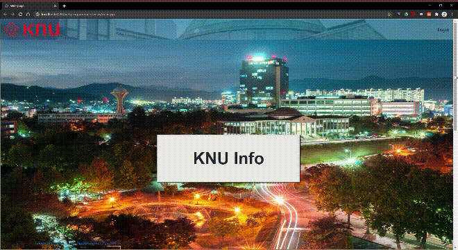

# KNU Info
> 2020년 1학기 [경북대학교][knu] [컴퓨터학부][knucse] 고급웹프로그래밍 6팀 프로젝트입니다.

## 각 페이지 설명

페이지 설명

## 데모 영상

## 개발 환경

* Eclipse EE
* Tomcat 9.0
* jsoup

## 팀원 정보

신주용 – [cheesecat47](https://github.com/cheesecat47) – cheesecat47@gmail.com
문찬성 – [chanSeong95](https://github.com/chanSeong95) – ckan0822@gmail.com
이형찬 – [eclairs1010](https://github.com/eclairs1010) – eclairs1010@gmail.com
정제현 – [JehyunJung](https://github.com/JehyunJung) – toojey7@gmail.com

[https://github.com/cheesecat47/KNU_Info](https://github.com/cheesecat47/KNU_Info)

[knu]: http://www.knu.ac.kr/
[knucse]: http://computer.knu.ac.kr/
