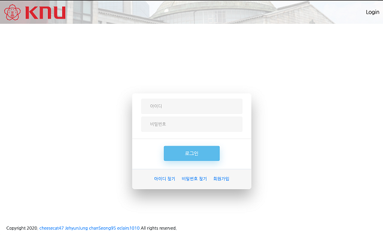
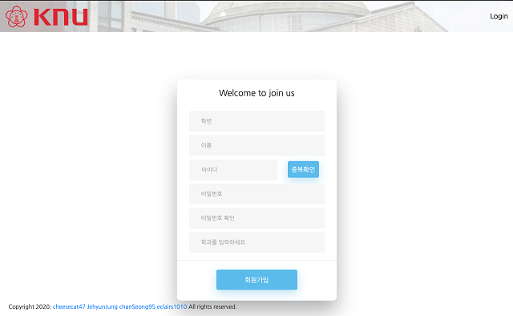
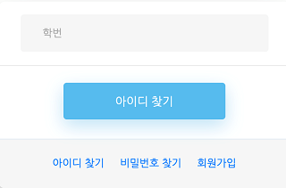
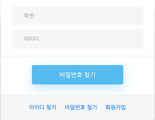
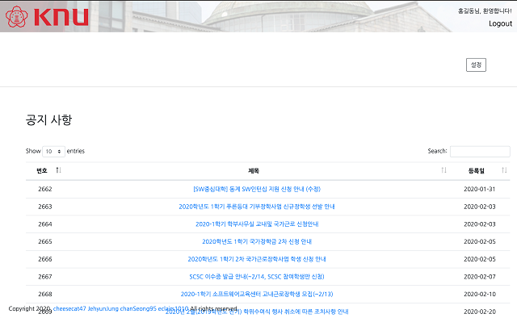
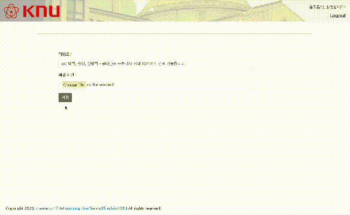

# KNU Info
> 2020년 1학기 [경북대학교][knu] [컴퓨터학부][knucse] 고급웹프로그래밍 6팀 프로젝트입니다.  
>
> 학과 홈페이지에는 많은 정보가 올라오지만 그 모든 정보가 나에게 필요한 것은 아닐 수 있습니다.  
> 그래서 자신의 학과, 원하는 검색 키워드를 저장하면 해당하는 정보만 찾아서 보여주는 페이지를 개발하는 것이 목표입니다.  
> 추가로 배경 이미지 설정 등 개인화된 경험도 제공합니다.  

---

## 개발 환경

* Eclipse EE
* Tomcat 9.0
* jsoup

## 팀원 정보

신주용 – [cheesecat47](https://github.com/cheesecat47) – cheesecat47@gmail.com  
문찬성 – [chanSeong95](https://github.com/chanSeong95) – ckan0822@gmail.com  
이형찬 – [eclairs1010](https://github.com/eclairs1010) – eclairs1010@gmail.com  
정제현 – [JehyunJung](https://github.com/JehyunJung) – toojey7@gmail.com  

## 각 페이지 설명

### 메인 화면
  
* 사이트 첫 화면입니다.  
  
### 로그인 화면
  
* 로그인 페이지입니다.  
    * 화면 디자인은 오픈 소스 부트스트랩 템플릿을 활용했습니다.  
* 아이디 / 비밀번호 찾기, 회원 가입 기능을 제공합니다.  
  
  
* 회원 가입 페이지입니다.  
* 아이디 중복 확인 기능을 제공합니다.  
* 회원 가입할 때 자신의 전공을 선택합니다.  
  

  
* 아이디 / 비밀번호 찾기 화면입니다.  
  
### 마이페이지 화면
  
* 로그인 성공 시 볼 수 있는 마이페이지입니다.  
* 크롤링 한 정보를 테이블을 이용해 보여줍니다.  
    * 오픈 소스 테이블 템플릿을 활용했습니다.  
    * 한 번에 보이는 목록 수를 선택할 수 있습니다.  
    * 페이지네이션 기능도 지원합니다.  
    * 검색 기능을 지원합니다.  
* 각 항목을 선택하면 학과 홈페이지 해당 공지글로 이동합니다.  
* 로그인이 되지 않은 상태로 주소창을 이용해 접근하려 하면 로그인 페이지로 이동합니다.  
  
### 개인설정 화면
  
* 사용자 설정 페이지입니다.  
* 자신이 원하는 키워드를 입력 가능합니다.  
* 자신이 원하는 배경 이미지도 설정 가능합니다.  
    * 이 배경 사진은 마이페이지와 개인설정 페이지에 적용됩니다.  

## 데모 영상

On Youtube: <https://youtu.be/9ouNuz7PaTw>  

## SCM
<https://github.com/cheesecat47/KNU_Info>  

[knu]: http://www.knu.ac.kr/
[knucse]: http://computer.knu.ac.kr/
